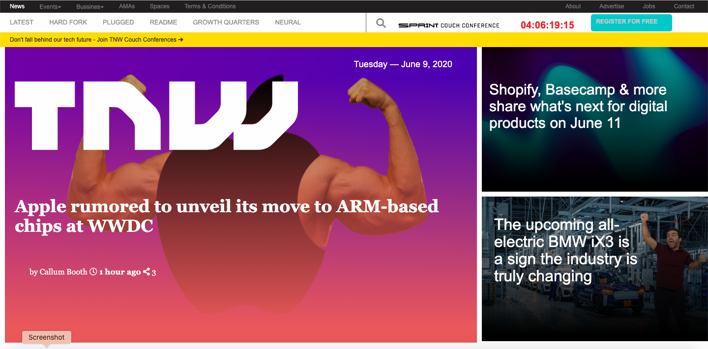
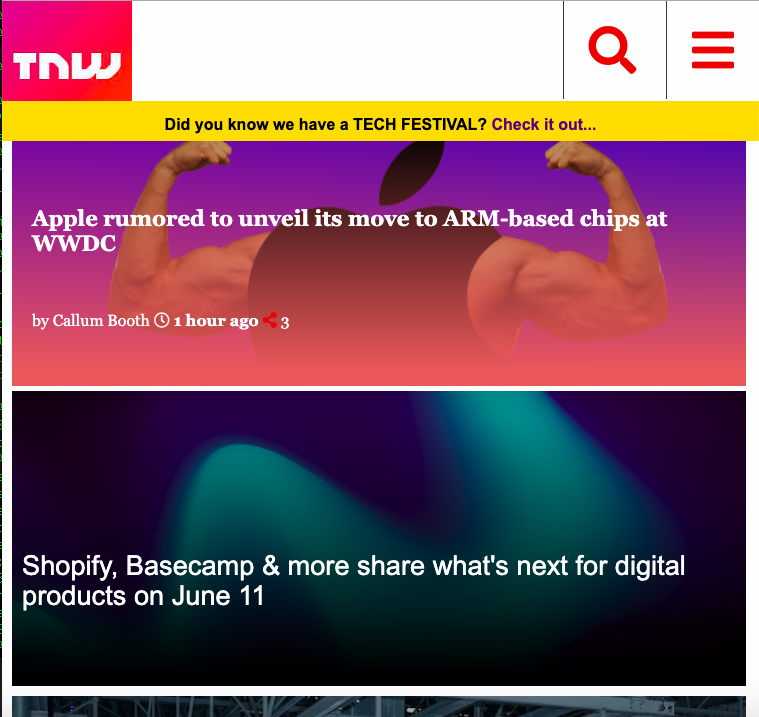
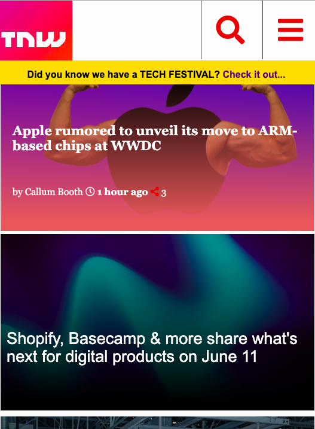

# TNW-Page
This is a The Next Web clone page by Carlos &amp; Adesoji.

## Big Screens 

## Middle Screens 

## Small Screens 

## Built With

- HTML
- CSS

## Live Demo

[Live Demo Link](https://rawcdn.githack.com/carlos-ssh/tnw-page/5f6e1e3ea2a31c988141a178b7d60a4d030e1344/index.html)

## Authors

👤 **Carlos Robles**

- Github: [@githubhandle](https://github.com/carlos-ssh)
- Twitter: [@twitterhandle](https://twitter.com/AomRobles)
- Linkedin: [linkedin](https://linkedin.com/carlosfloresrobles)

👤 **Adesoji Adewumi**

- Github: [@AdesojiCodeMaster](https://github.com/)
- Twitter: [@CodeMas22665735](https://twitter.com/)
- Linkedin: [linkedin](https://www.linkedin.com/in/adesoji-adewumi-7752aba5)

## 🤝 Contributing

Contributions, issues and feature requests are welcome!

Feel free to check the [issues page](issues/).

## Show your support

Give a ⭐️ if you like this project!

## Acknowledgments

- Thanks to Microverse.
